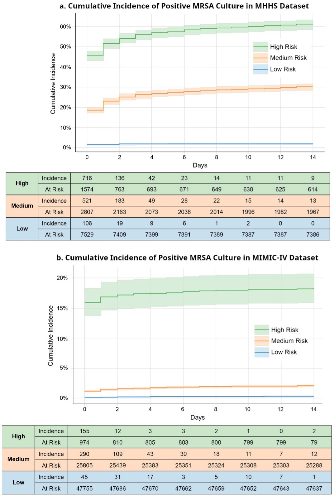

## Personalized Prediction of Positive MRSA Culture Using Electronic Health Records(EHR)
***************** 

This code repository provides the code to run the methicillin-resistant Staphylococcus aureus (MRSA) project that uses PyTorch_EHR, which leverages EHR time-series data, including wide-variety patient specific data, to predict MRSA culture positivity within two weeks.

**Overview**

MRSA poses significant morbidity and mortality in hospitals. Rapid, accurate risk stratification of MRSA is crucial for optimizing antibiotic therapy. Our study used PyTorch_EHR to predict MRSA culture positivity within two weeks. 8,164 MRSA and 22,393 non-MRSA patient events from Memorial Hermann Hospital System, Houston, Texas are used for model development.

 <be>

This figure shows the schematic structure of the deep learning-based prediction model (PyTorch_EHR) for MRSA-positive cultures. Figure a summarizes the overall structure of the model used to predict MRSA-positive cultures over a two-week period from the index culture. Our model integrates multiple structural data tables from EHRs as time-sequenced data prior to the index time. PyTorch_EHR is employed to predict MRSA-positive cultures over two weeks from the index time. Figure b describes scenarios where patients experience multiple events over time. 

**Results**

 <be>

This figure is the cumulative incidence curve of positive MRSA over two weeks in the MHHS and MIMIC-IV Datasets. Figures a and b show the cumulative incidence of MRSA cultures in Memorial Hermann Hospital System (MHHS) and Medical Information Mart for Intensive Care (MIMIC)-IV datasets, respectively. Both figures were generated based on the risk predicted by our model in test datasets. Given the significant imbalance in the MIMIC-IV dataset, even high-risk patients achieved 20% positivity compared to the MHHS dataset. In contrast, the low-risk patient group had fewer false negatives. 

**Steps to reproduce the model**

1. Data: We won't provide the original MHHS and MIMIC-IV datasets, you may acquire the MIMIC-IV data from [physionet.org](https://physionet.org/content/mimiciv/2.1/).

2. Data preprocessing: The file `Data_preprocessing_step1_mapping_20240121.ipynb` is the first step of the data preprocessing, which mainly focuses on mapping files for MHHS and MIMIC-IV datasets. Make sure files `mimic4_preprocess_util.py` and `preprocess_util.py` and under the same folder. The next step of data preprocessing is shown in the file `Data_preprocessing_step2_20240121.ipynb`, which takes the output cvs files from `Data_preprocessing_step1_mapping_20240121.ipynb` and prepares them as the suitable input format for the file `preprocess_outcomes.py`. Please refer to the below figure for more details about the data preprocess flow.

 <be>

3. Model training: After getting the output files from `preprocess_outcomes.py`, you may use them to run `Main_Training_20240121.ipynb`. Please also make sure the file `train_util.py` is under the same folder.

**Paper Reference**

Please refer to our paper

>**Deep Learning Model for Personalized Prediction of Positive MRSA Culture Using Time-Series Electronic Health Records** Masayuki Nigo, Laila Rasmy, Bingyu Mao, Bijun Sai Kannadath, Ziqian Xie, Degui Zhi

for more details.

**Dependencies**

* Python: 3.6+
* Required Python packages can be installed using `pip install -r requirements.txt`.
 
**License**

* This repo is for research purposes. Use it at your own risk. 
* This repo is under GPL-v3 license. 
